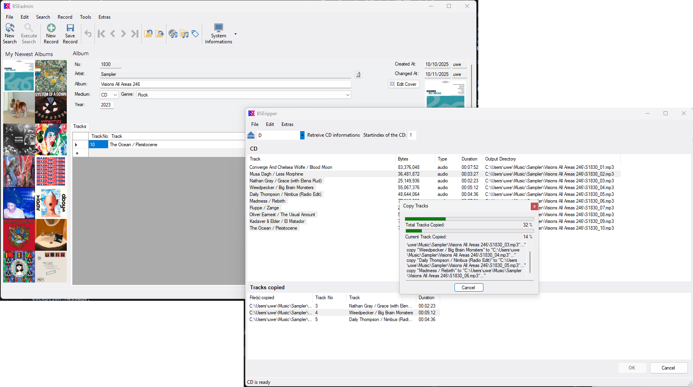
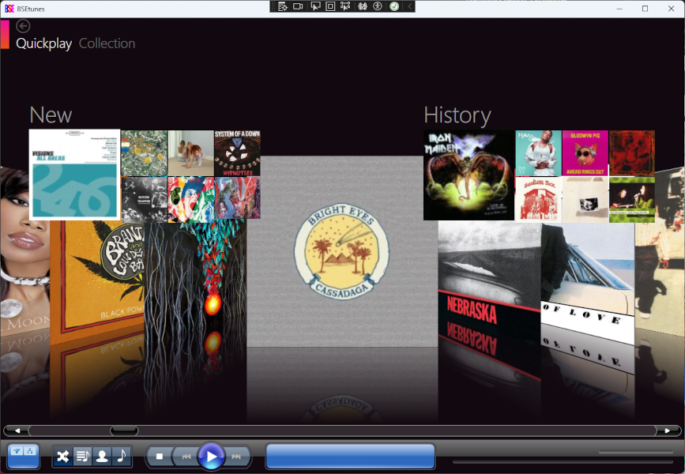

# windows.forms
This repository contains .NET 4.8 System.Windows.Forms and Wpf projects used for manage the BSE system and play it's content.

Firstly, the repository was migrated from vss to git, and the .NET version was updated to 4.8. Because the currently used MySQL database is outdated (version 5.x), a new MySQL connector is being used.

### BSEadmin with the ripper

### BSEtunes Wpf player
